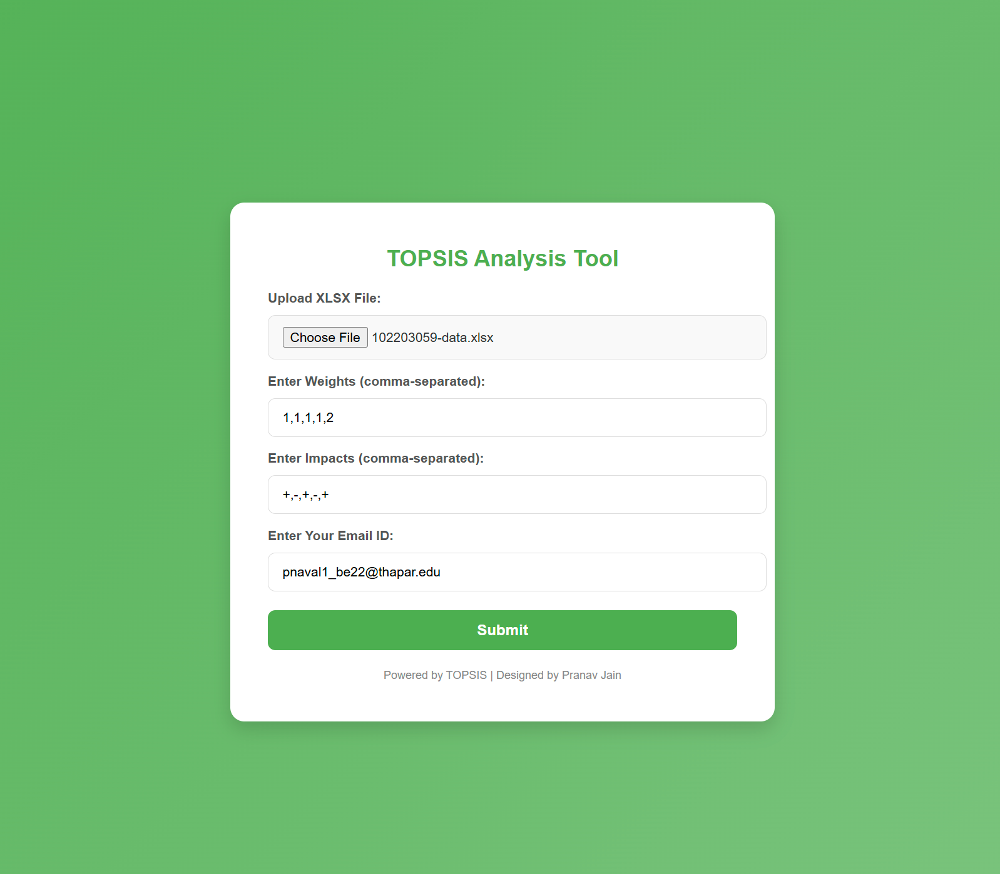
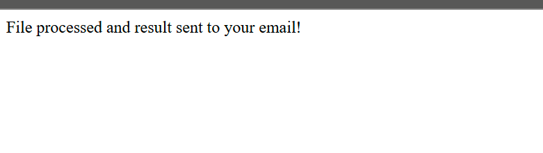

# TOPSIS Analysis Tool

A web-based application that implements the **Technique for Order Preference by Similarity to Ideal Solution (TOPSIS)** method using a self-created Python package. This tool allows users to upload an Excel file, specify weights and impacts, and receive the computed TOPSIS scores and rankings directly via email.

## Features
- Uses a **self-made Python package** for implementing the TOPSIS method.
- Accepts user inputs like weights, impacts, and file uploads through a user-friendly interface.
- Sends the TOPSIS result file to the user via email.
- Simple, intuitive design for ease of use.

---

## How It Works
1. The user uploads an `.xlsx` file containing criteria and alternatives.
2. Inputs the weights and impacts for each criterion.
3. Submits the form with their email address.
4. The app processes the file using the self-made TOPSIS package.
5. Computes the TOPSIS scores and ranks the alternatives.
6. Sends the results as a downloadable `.csv` file to the provided email.

---

## Installation and Setup
### Prerequisites
- Python 3.6 or above
- Required Libraries: Flask, pandas, numpy, smtplib

### Steps
1. Clone this repository:
   ```bash
   git clone https://github.com/your-username/TOPSIS-Analysis.git
   cd TOPSIS-Analysis
   ```

2. Install dependencies:
   ```bash
   pip install -r requirements.txt
   ```

3. Run the Flask app:
   ```bash
   python app.py
   ```

4. Open your browser and go to:
   ```
   http://127.0.0.1:5000/
   ```

---

## Usage
1. Upload your `.xlsx` file with at least the following structure:
   ```
   Alternative Name | Criterion 1 | Criterion 2 | ...
   ```
2. Enter weights (comma-separated, e.g., `1,1,1,2`).
3. Enter impacts (`+` for positive, `-` for negative, e.g., `+,+,-,+`).
4. Provide a valid email address.
5. Click **Submit** to receive the TOPSIS result file via email.

---

## Screenshots
### 1. Home Page


### 2. TOPSIS Result Submission



---

## Technologies Used
- **Flask**: Web framework for the interface.
- **Python**: Core language for the backend.
- **Pandas**: Data manipulation.
- **NumPy**: Mathematical operations.
- **SMTP**: For email integration.

---

## Contact
For queries, contact:
- **Author**: Pranav Jain
- **Email**: pjain_be22@thapar.edu
